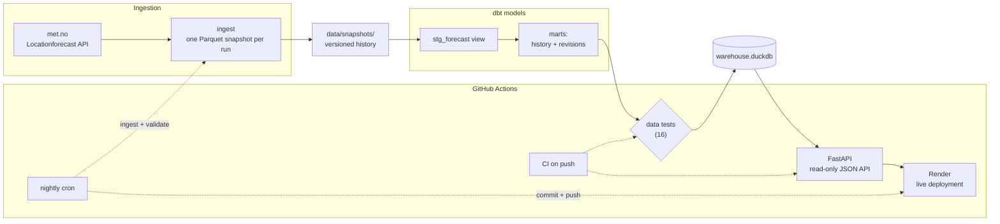

# met-weather-pipeline

[](https://github.com/eckballtor/met-weather-pipeline/actions/workflows/ci.yml)  
[](https://github.com/eckballtor/met-weather-pipeline/actions/workflows/nightly-snapshot.yml)
  
**Live API:** https://met-weather-pipeline.onrender.com

This project runs a small data pipeline that collects public weather forecasts from [met.no](https://www.met.no/) for Oslo and Bergen. It stores each collection run as a timestamped Parquet snapshot, and models the accumulated snapshots into a DuckDB warehouse with dbt. Because each forecast for a given hour is captured repeatedly over time, the data allows a concrete question: how did the forecast for a specific hour change as newer forecasts arrived? The warehouse holds the answer as a revision history. Data-quality tests gate every build, a read-only FastAPI serves the results as JSON, GitHub Actions runs CI on each push, and a nightly workflow collects and validates a new snapshot on its own. The service is deployed from this repository and runs at [met-weather-pipeline.onrender.com](https://met-weather.pipeline.onrender.com).


## What it produces

Each run of the pipeline captures the full met.no forecast for Oslo and Bergen and stores it as an immutable, timestamped Parquet snapshot under `data/snapshots/`. It produces one file per run, one row per location and forecast hour, each row timestamped. Because the snapshots accumulate instead of overwriting each other, the warehouse can answer a question the source API never poses: **what did the forecast claim initially, and what does it claim now for the same hour?**

The staging model unions every committed snapshot and dbt models them into two tables. Each hour's forecast in consecutive snapshots is paired against its predecessor with the temperature change. Data tests validate both tables and the revisions mart is built so each row always has a predecessor by construction. The history grows since a nightly workflow commits and deploys another snapshot every day.


## Architecture

The repository is organized in five layers, each in its own directory: ingestion (`ingest/`), dbt models (`models/`), the warehouse (warehouse.duckdb is built by dbt and therefore not committed), the API (`api/`), and automation (`.github/workflows/`). Data moves in one direction: met.no → Parquet snapshot → dbt staging and marts → warehouse → API. Nothing in the serving path writes anything. The API opens the warehouse read-only, and all modeling happens in dbt before anything is served.



- **Ingestion** (`ingest/ingest.py`): fetches met.no Locationforecast 2.0 (compact). No API key. Writes one timestamped Parquet snapshot per run.
- **dbt models** (`models/`): `stg_forecast` is a view over all snapshots via one glob. `fct_forecast_history` materializes every claim ever made, enriched with `lead_time_hours`. `fct_forecast_revisions` pairs consecutive snapshots per (location, hour) with a `lag()` window and records the temperature change. Quality is asserted by 12 generic tests plus 1 custom SQL test.
- **API** (`api/main.py`): FastAPI with short-lived, read-only DuckDB connections. Endpoints: `/health`, `/locations`, `/forecasts/{location}/latest`, `/revisions/{location}`. Interactive docs at `/docs`.
- **Automation** (`.github/workflows/`): CI on every push (dependency sync, dbt build, API smoke test). A nightly workflow ingests a fresh snapshot, validates it with all tests, and commits it. A snapshot enters history only when every test passes, and each push triggers an automatic redeploy on Render.


## Design decisions

- **DuckDB as the warehouse.** DuckDB is a database engine used as a library, not as a service. Code opens one database directly, runs SQL on it, and closes it again. There is no server process or any other database service to install. The repository's entire warehouse is one such file, `warehouse.duckdb`. It is created by `dbt build` and read by the API in read-only mode. Because dbt reaches warehouses via interchangeable adapters, the same model code would run unchanged against other warehouse solutions such as PostgreSQL or Snowflake.
- **Snapshot history in git.** Each snapshot is a small Parquet file, so the accumulated history is committed under `data/snapshots/`. This is needed because a container build is stateless and would create exactly one snapshot. With the history in the repository, every build inherits all previous snapshots and extends them by one more.
- **The image build is a pipeline run.** The Dockerfile ingests fresh data and runs `dbt build` while the image is created. `docker run` serves a warehouse complete as of build time. Rebuilding the image is the refresh mechanism.
- **Tests are deploy gates.** The same dbt tests run locally, on every push in CI, in the nightly workflow before a snapshot is committed, and inside every image build. Data that fails a test stops at that point and never reaches the warehouse or the live service.
- **No credentials.** The met.no API requires no key, and `profiles.yml` contains no credentials. The repository therefore stays public and self-contained.


## Quickstart

Clone the repository and run:

```bash
> uv sync --frozen                           # install locked dependencies
> uv run python -m ingest.ingest             # optional: fetch a fresh snapshot (because the versioned history is already committed)
> uv run dbt build --profiles-dir .          # build the warehouse and run all tests
> uv run uvicorn api.main:app --port 8000    # serve the API on localhost:8000
```

Alternatively, as one image: Building the image actually is a pipeline run. The resulting container serves a warehouse complete as of build time:

```bash
> docker build -t met-weather-pipeline .  
> docker run -p 8000:8000 met-weather-pipeline
```

The API then is in both cases available at http://localhost:8000 with interactive documentation at `/docs` and revision analysis at `/revisions/oslo`.

Alternatively, you can see the live deployment at: https://met-weather-pipeline.onrender.com/

The first request after idle takes up to 90 seconds while the services wakes.
